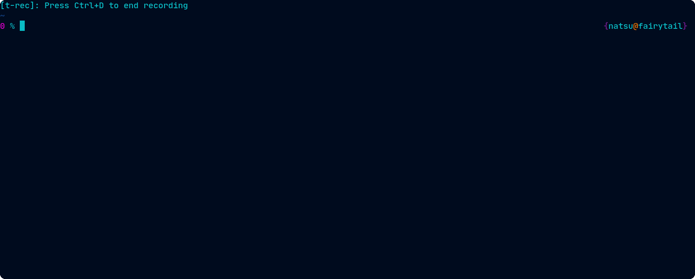
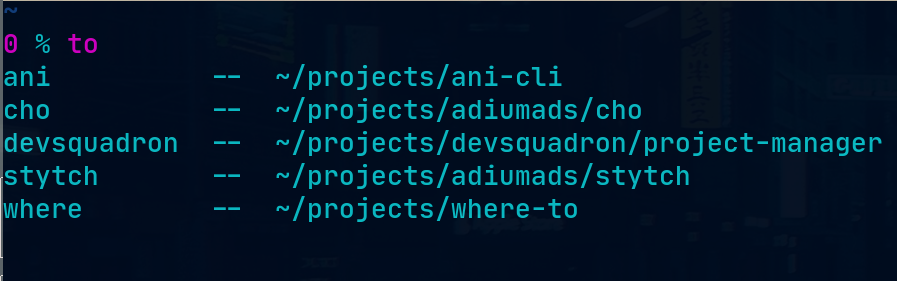

# where-to

I'm here, I'm there ;)

### `to` command jumps from one place to another on your OS with the help of command completion and a simple config file.


### `dn` & `up` commands navigate up or down a directory with a post hook to clear and list the contents.


### `t` command justs clears and lists the current directory vertically.


# Dependencies

By default, where-to uses the `ls` to show directories.

You can install [exa](https://github.com/ogham/exa) or [tree](https://gist.github.com/fscm/9eee2784f101f21515d66321180aef0f) for a better experience.

# Installation

### 1. binaries

You can grab a precompiled binary from the [releases page](https://github.com/nanvenomous/where-to/releases/)

Then run the following for the liunx binary for example:
```
tar -xf linux.tar.xz
cd ./bin/linux
sudo mv ./* /usr/local/bin/
```

If you prefer to install from source (this requires you to [install go](https://go.dev/doc/install))
```
git clone https://github.com/nanvenomous/where-to.git
cd where-to
make
sudo make install
```
### 2. completions

You will need to run the completion command for your given shell

Note: check which shell you are running with `echo "${SHELL}"`

Then run **only one** of the following
```
sudo make zsh-completions
sudo make bash-completions
```
### 3. You need to add the plugin to your shell

Add the following line to your shell file (i.e. `.bashrc` or `.zshrc`):
```
eval "$(where-to init)"
```

### 4. Configuration (i.e. adding places to go)

You can always edit `~/.config/where-to.yaml` manually

but I recommend to use the convenience functions

here's an example where I add an alias for `~/.config/nvim` so I can edit my neovim config file:



The config file maps an alias to a directory on your machine so you can run:

> to [alias]

and you will be navigated to the corresponding directory

### Shell compatibility

Pull requests welcome!
- [x] zsh
- [x] bash
- [ ] fish
- [ ] xonsh

# Motivation
This project is heavily inspired by [zoxide](https://github.com/ajeetdsouza/zoxide)

However, `where-to` has a more declarative approach & focuses on autocompletion rather than fuzzy-finding

for example, if you don't know where you want to go try running
> to \t

(that's to\<space\>\<tab\>)



and find your way from there!
