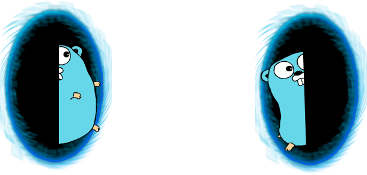

# where-to

I'm here, I'm there ;)

### `to` command jumps from one place to another on your OS with the help of command completion and a simple config file.


### `dn` & `up` commands navigate up or down a directory with a post hook to clear and list the contents.


### `t` command justs clears and lists the current directory vertically.


# Dependencies

By default, where-to uses ls to show directories.

You can install [exa](https://github.com/ogham/exa) or [tree](https://gist.github.com/fscm/9eee2784f101f21515d66321180aef0f) for a better experience.

# Installation

### 1. binaries & completions
```
git clone https://github.com/nanvenomous/where-to.git
cd where-to
sudo make install
# then do one of the following
sudo make zsh-completions
sudo make bash-completions
```

### 2. You need to add the plugin to your shell

Add the following line to your shell file (i.e. `.bashrc` or `.zshrc`):
```
eval "$(where-to init)"
```

### 3. Working on convenience functions, but for now just make a config file

~/.config/where-to.yaml
```
cho: "/home/natsu/projects/adiumads/cho"
where: "/home/natsu/projects/where-to"
ani: "/home/natsu/projects/ani-cli"
```

The config file maps an alias to a directory on your machine so you can run:

> to [alias]

and you will be navigated to the corresponding directory

### Shell compatibility

Pull requests welcome!
- [x] zsh
- [x] bash
- [ ] fish
- [ ] xonsh

# Inspiration
This project is heavily inspired by [zoxide](https://github.com/ajeetdsouza/zoxide), but has a more declarative approach & focuses on autocompletion rather than fuzzy-finding.
