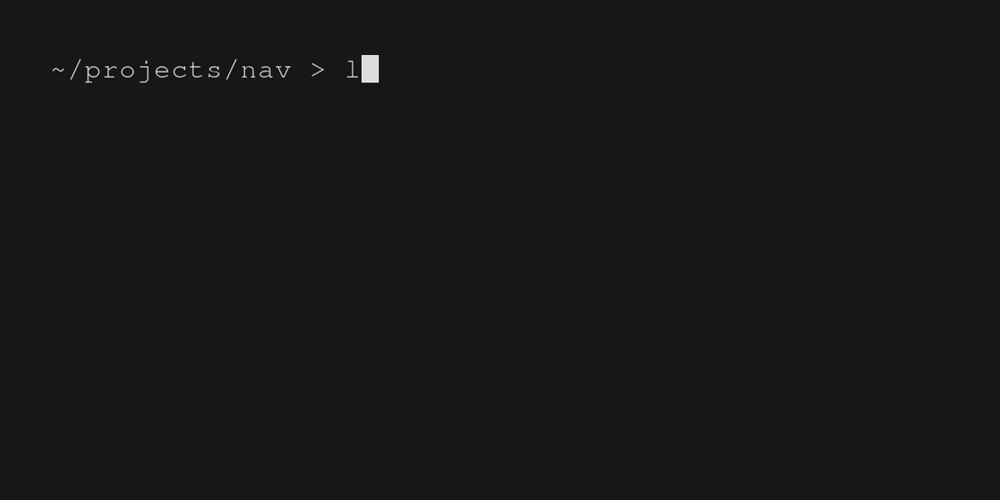
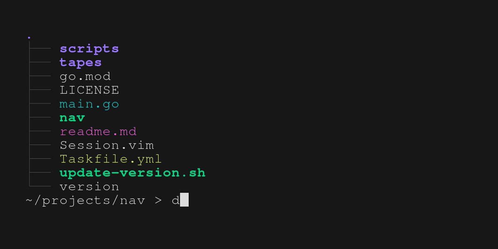
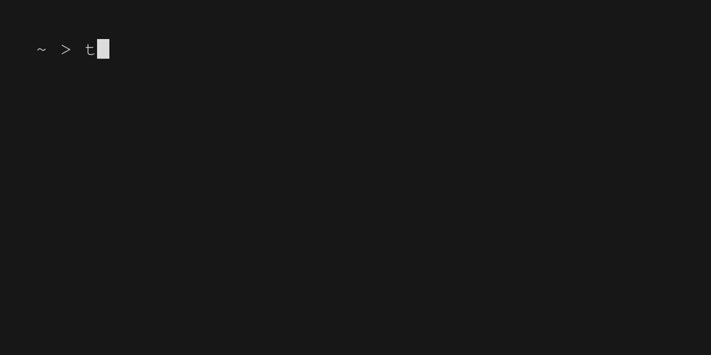

# nav: a terminal navigation helper

A lightweight Go Command Line App that generates shell functions for enhanced terminal navigation with `t`, `dn`, `to`, and `up`  commands.

## Why

We all have our aliases and tools for getting around our systems.
One problem I run into is easily porting said tools to new machines. 
With nav you can run a few commands and it gets a lot easier to traverse the file system.

## Installation & Setup

1. Prerequisites: it's recommended to install `fzf` & either `tree` or `eza` commands which nav uses
2. **Install the CLI tool:**
   ```bash
   go install github.com/nanvenomous/nav@latest
   # or build locally

   git clone https://github.com/nanvenomous/nav.git
   cd nav
   go build -o nav
   ```

3. **Add navigation functions to your shell:**
   ```bash
   eval "$(nav)"                        # Run in the current shell only
   echo 'eval "$(nav)"' >> ~/.bashrc    # add to .bashrc
   echo 'eval "$(nav)"' >> ~/.zshrc     # add to .zshrc
   ```

4. **Start using the navigation commands:**
   ```bash
   t           # clears terminal and lists files & directories
   dn mydir    # Move into mydir  
   to          # Interactive navigation with fzf
   up 2        # Move up 2 directories
   ```

## Commands

### `t`  
Clears the terminal contents and pretty lists the current directory


### `dn <directory>`  
Move down into a directory (equivalent to `cd <directory>`)

- **Directory-only:** Only accepts directories, not files
- **Tab completion:** Supports shell completion for directory names
- **Clears terminal** and lists directory contents after navigation

### `to`
Interactive directory navigation using `fzf`

- **File preview:** Shows current directory files at top, then interactive directory selection
- **Interactive selection:** Navigate directories with fzf
- **Parent navigation:** Includes `..` option to go up one level  
- **Continuous loop:** Keeps running until you exit (Escape or Ctrl+C)
- **Clears terminal** and lists contents after each selection
- **Requires fzf:** Must have `fzf` installed

### `up [levels]`
Move up directories (equivalent to `cd ..`)

- **Default:** `up` moves up 1 level
- **Multi-level:** `up 2` moves up 2 levels, `up 3` moves up 3 levels, etc.
- **Clears terminal** and lists directory contents after navigation


## Features

### Smart List Command Detection
Automatically uses available directory listing tools:

1. **eza** (preferred): `eza --tree --level=1 --group-directories-first`
2. **tree** (preferred): `tree -C -L 1 --dirsfirst`
3. **ls variants (fallback):**
   - Linux: `ls --color=auto --group-directories-first -1`
   - macOS: `ls -G -1`
   - Other: `ls -1`

### Shell Integration
- **Cross-shell compatible:** Works with bash, zsh, and other POSIX shells
- **Tab completion:** Directory completion for `dn` command
- **Error handling:** Proper error messages and validation
- **Clean output:** Each command clears terminal before showing new directory

## Distribution

The CLI tool approach allows for easy distribution:
- From Source
    ```bash
    go install github.com/yourorg/nav@latest
    echo 'eval "$(nav)"' >> ~/.bashrc
    ```
- Direct Download (this example for linux, see [releases](https://github.com/nanvenomous/nav/releases) for more options)
    ```bash
    curl -L https://github.com/nanvenomous/nav/releases/latest/download/nav-linux-amd64 > nav
    chmod +x nav
    echo 'eval "$(nav)"' >> ~/.bashrc
    ```
- Source the shell file directly
    ```bash
    git clone https://github.com/nanvenomous/nav.git
    echo 'source ./nav/scripts/nav-functions.sh' >> ~/.bashrc
    ```

## Dependencies

### Required
- **Go 1.21+** (for building)
- **POSIX shell** (bash, zsh, etc.)

### Optional  
- [fzf](https://github.com/junegunn/fzf) - Required for `to` command interactive navigation
- [eza](https://github.com/eza-community/eza) - Enhanced directory listings (recommended)
- [tree](https://gitlab.com/OldManProgrammer/unix-tree) - Tree-style directory listings (recommended)

## Technical Details

This lightweight tool:
- Generates clean, portable shell functions (see shell functions [here](https://github.com/nanvenomous/nav/blob/mainline/scripts/nav-functions.sh))
- Provides proper error handling and validation
- Supports cross-platform directory operations
- Includes shell completion setup
- Zero external dependencies (single static binary)

The generated shell functions are self-contained and don't require the CLI binary at runtime - they only need standard shell utilities and optionally fzf for the `to` command.

## Why This Approach?

1. **Easy distribution:** Single binary that sets up everything
2. **Shell integration:** Functions run in your current shell, actually changing directories
3. **Portable:** Generated functions work across different shells and systems
4. **Self-contained:** No runtime dependency on the CLI tool once installed
5. **Package-friendly:** Can be distributed via package managers, GitHub releases, etc.

Perfect for dotfiles, team setups, or any scenario where you want enhanced terminal navigation!
